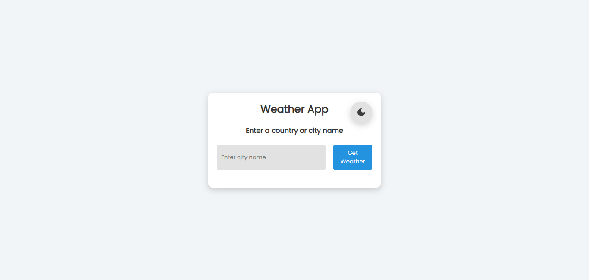
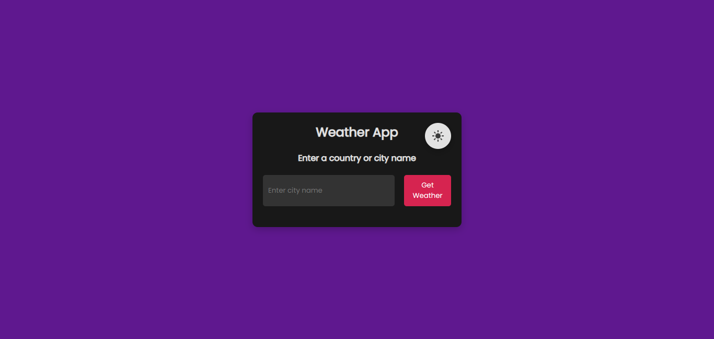

# Weather App

## Description
The Weather App is a simple web application that allows users to check the current weather conditions of any city using the OpenWeather API. The app provides details such as temperature, wind speed, and a weather description, along with an appropriate weather image. It also includes a theme toggle feature to switch between light and dark modes.

## Features
- Fetches real-time weather data using OpenWeather API.
- Displays city name, temperature, wind speed, and weather description.
- Shows relevant weather images based on temperature.
- Includes a dark mode toggle that persists across sessions using local storage.
- Responsive design for various screen sizes.

## Technologies Used
- HTML
- CSS
- JavaScript
- OpenWeather API

## Setup Instructions
1. Clone the repository or download the source code.
2. Obtain an API key from [OpenWeather](https://openweathermap.org/api).
3. Create a `config.js` file and add the following line:
   ```js
   window.API_KEY = "YOUR_OPENWEATHER_API_KEY";
   ```
4. Open `index.html` in a browser to use the application.

## File Structure
```
Weather-App/
│── index.html
│── styles.css
│── script.js
│── config.js (API key configuration)
└── assets/ (optional: store additional images or resources)
```

## Usage
1. Enter a city name in the input box.
2. Click on the "Get Weather" button.
3. View the weather details including:
   - City Name
   - Temperature (in Celsius)
   - Weather Description
   - Wind Speed (in km/hr)
4. Toggle between dark and light mode using the theme switch button.

## API Endpoint Used
The app fetches weather data from the following endpoint:
```plaintext
https://api.openweathermap.org/data/2.5/weather?q={cityName}&units=metric&appid={API_KEY}
```

## Screenshot

### Light Mode


### Light Mode


## Future Enhancements
- Add hourly and weekly weather forecasts.
- Implement geo location-based weather detection.
- Improve UI/UX with animations and better styling.
- Support for multiple units (Celsius, Fahrenheit, Kelvin).

## License
This project is open-source and free to use under the MIT License.

---

### Created by Harish

